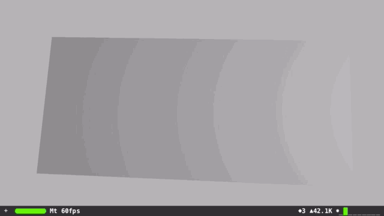

# SceneKit Metal Deformable Mesh
SceneKit mesh deformed by a Metal compute shader

A `SCNGeometry` mesh object is built from several `SCNGeometrySource` objects created using the [`geometrySourceWithBuffer`](https://developer.apple.com/library/prerelease/ios/documentation/SceneKit/Reference/SCNGeometrySource_Class/index.html#//apple_ref/occ/clm/SCNGeometrySource/geometrySourceWithBuffer:vertexFormat:semantic:vertexCount:dataOffset:dataStride:) method.

Two duplicate buffers (`MTLBuffer`'s) store the Vertex data, as a Metal compute shader cannot read and write to the same buffer. Another buffer is used for the normal data.

The mesh is deformed using two computer shaders `deformVertex` deforms each of the vertex locations in the mesh based on a location, radius of influence, deformation amount and direction. The second shader updates the normals based on the deformed vertex data, and copies the vertexes from the output buffer back to the input buffer (which the `SCNGeometry` object uses).

# License
MIT
